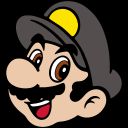
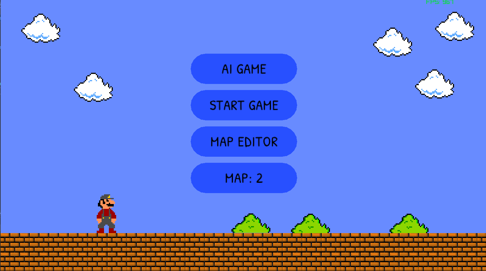

# Mario AI

## Opis
**Mario AI** jest to projekt który miał na celu stworzyć sieć neuronową i przetestować ją w klonie klasycznej gry Super Mario Bross.

.png)

.png)

## Sieć Neuronowa
**Sieć Nauronowa** powstała [na podstawie](Docs/Sieci_neuronowe_Stanley_Miikkulainen.pdf) i została zaimplementowana [w klasie](MarioAI/MarioAI/src/NN.h)
