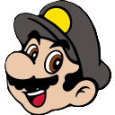

# Mario AI

## Opis
**Mario AI** jest to projekt który miał na celu stworzyć sieć neuronową i przetestować ją w klonie klasycznej gry Super Mario Bross.

.png)

## Sieć Neuronowa
**Sieć neuronowa** powstała [na podstawie](Docs/Sieci_neuronowe_Stanley_Miikkulainen.pdf) i została zaimplementowana [w klasie](MarioAI/MarioAI/src/NN.h). Reprezentacja graficzna sieci oraz połączeń jest przedstawiona w górnej części ekranu.
.png)

## Edytor Poziomów
**Edytor poziomów** powstał do tworzenia różnorodnych map by tworzyć różnorodne mapy na których sztuczna inteligencja może się edukować.
.png)
.png)
